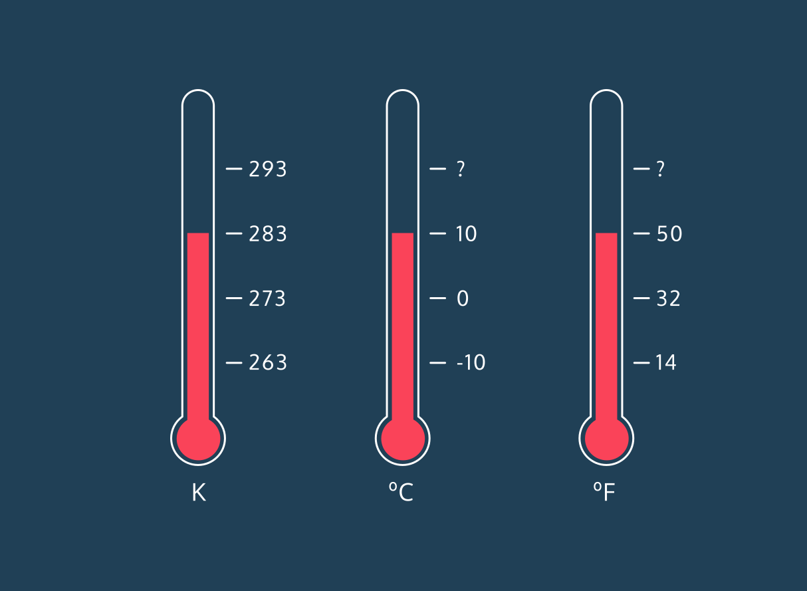

[Lesson Link](https://www.codecademy.com/paths/build-web-apps-with-react/tracks/intro-to-building-web-apps-with-React/modules/overview-of-react/projects/kelvin-weather-javascript)

### CREATE A FRONT-END APP WITH REACT

**Kelvin Weather**

Deep in his mountain-side meteorology lab, the mad scientist Kelvin has mastered weather prediction.

Recently, Kelvin began publishing his weather forecasts on his website. However there’s a problem: All of his forecasts describe the temperature in Kelvin.

With our knowledge of JavaScript, let’s convert Kelvin to Celsius, then to Fahrenheit.

For example, 283 K converts to 10 °C which converts to 50 °F.

If you get stuck during this project or would like to see an experienced developer work through it, click “Get Unstuck“ to see a project walkthrough video.

Learn JavaScript: Kelvin Weather:

https://www.youtube.com/watch?v=WlA1gy6fpgY
